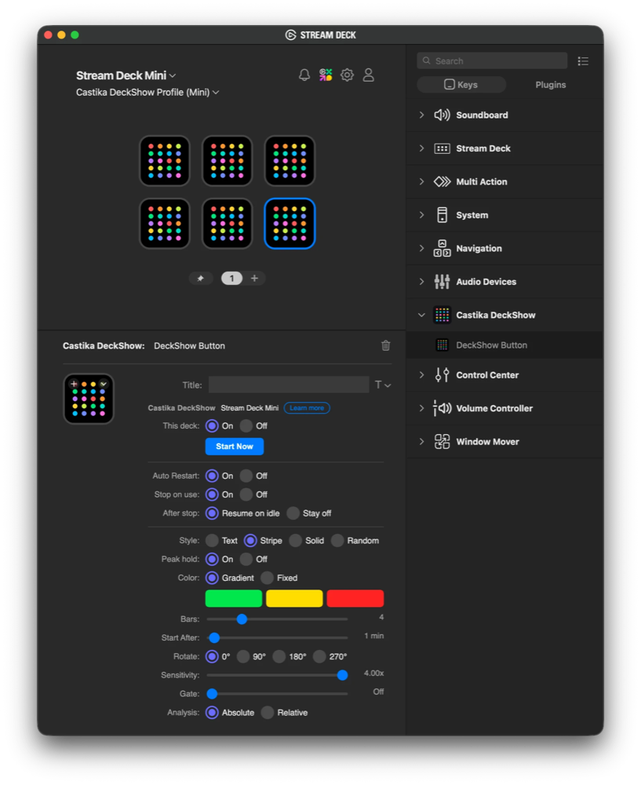

# Castika DeckShow

An audio-reactive visualizer for the Elgato Stream Deck (Bitfocus Companion included). While your computer sits idle, your deck becomes a visualizer. It runs on macOS and Windows.

**[English](#english) / [한국어](#한국어) / [日本語](#日本語)**

---

## English

Requirements:
- Stream Deck app 6.5 or later, or Bitfocus Companion
- Python, the latest stable release (anything from 3.9 up works)

(If it is not on your computer yet, follow what the installer tells you.)

### Installation

#### 1. Make a folder

Make a folder wherever you want the program to live.

#### 2. Unpack

Copy the archive you downloaded from the GitHub repository into that folder and unpack it. The `dev/` folder on GitHub holds the development sources, so you do not need it to run the program.

#### 3. Run the installer

- **macOS:** double-click `Install-Mac.command`.  
  If Gatekeeper blocks it: System Settings > Privacy & Security > Open Anyway, then double-click it again.
- **Windows:** double-click `Install-Win.cmd`.  
  If SmartScreen warns you: More info > Run anyway.

#### 4. Place a button

**If you use the Stream Deck app**

> 1. The installer installs the Stream Deck plugin. If the Stream Deck app is already running, restart it.
> 2. The first time the plugin runs, the Stream Deck app asks whether to add the show's own profile **Castika DeckShow Profile (device)** to your deck. That profile lets a whole page work together as one show. Please approve it. If you do not, the show is drawn only on the page that holds a **DeckShow Button**, with no page switch.
> 3. If you want to, open **Castika DeckShow** in the key list and place **DeckShow Button** where you want it, to lay out a page of your own.

**If you use Bitfocus Companion**

> 1. Click Launch GUI in Companion.
> 2. Choose Modules in the menu and install the module.  
>    Modules > Import Module Package > the `companion/` folder in your install folder > `castika-deckshow-<version>.tgz`.
> 3. Choose Connections in the menu, click Add Connection, search for **Castika DeckShow** and add it. Everything about how the show runs is set by opening this Connection.
> 4. Choose Buttons in the menu and place the **DeckShow Button** preset from Presets where you want it.

#### 5. Allow microphone access

- **macOS:** when the first show starts, macOS asks for microphone access for **Castika.DeckShow**. Choose Allow.
- **Windows:** go to Settings > Privacy & security > Microphone. Turn on both *Microphone access* and *Let desktop apps access your microphone*.

The show starts once the idle time set in the button settings has passed, or when you press a button, and a button press ends it. Hold a button for 1.5 seconds or longer and the show will not start on idle for the rest of this session. Press a button briefly to let the idle time start it again.

### Moving and removing

1. **If you moved the folder:** run the installer again in the new place. Everything is re-wired to that place. The old folder is no longer used, so you can delete it as a whole.

2. **If you want to remove the program:** run `Uninstall-Mac.command` (macOS) or `Uninstall-Win.cmd` (Windows) in that folder. A running show stops and every file and folder the install created is removed. The files you had before you installed stay.

### macOS

- Click `Install-Mac.command` to install.
- If Python is missing, or neither the Stream Deck app nor Bitfocus Companion is there, install that first.
- Python comes with macOS (Apple Command Line Tools). If it is missing, `Install-Mac.command` asks macOS to install it and then quits. Finish that install and run it again.
- What the install creates on your Mac (the uninstaller `Uninstall-Mac.command` removes all of it):

| Item | Where |
| --- | --- |
| Python packages | `.venv/` in this folder |
| `Castika.DeckShow.app` | The launcher in this folder. Built right on your Mac by macOS's own script compiler. |
| Login item | `~/Library/LaunchAgents/com.castika.deckshow.plist` |
| Plugin symlink | `~/Library/Application Support/com.elgato.StreamDeck/Plugins/` |
| Settings and font files | `~/Library/Application Support/DeckShow` |

- Once installed, you can see **Castika.DeckShow** in the microphone permission dialog, in System Settings > General > Login Items & Extensions, and in the menu bar's list of apps using the microphone.
- In the Stream Deck app, every DeckShow button carries its own settings panel. If that panel stays empty, open http://127.0.0.1:18790/pi in a browser and change the settings there.
- To read the logs, look in the `logs/` folder.

### Windows

- Click `Install-Win.cmd` to install.
- If Python is missing, or neither the Stream Deck app nor Bitfocus Companion is there, install that first.
- Take the **Windows installer** that [python.org](https://www.python.org/downloads/windows/) recommends and install it. (Anything from 3.9 up works.)
- If the Python installer asks about the path, tick *Add python.exe to PATH*.
- With a brand-new Python release, some packages are not ready yet and pip can fail. Use an earlier Python release in that case.
- What the install creates on your PC (the uninstaller `Uninstall-Win.cmd` removes all of it):

| Item | Where |
| --- | --- |
| Python packages | `.venv\` in this folder |
| `Castika.DeckShow.exe` | The launcher in this folder. Compiled right on your PC by the C# compiler that comes with Windows. |
| Startup shortcut | The Startup folder |
| Plugin junction | `%APPDATA%\Elgato\StreamDeck\Plugins\` |
| Settings and font files | `%APPDATA%\DeckShow` |

- Once installed, you can see **Castika.DeckShow** in Task Manager, in the Startup apps list and in the list of apps using the microphone. If the microphone is blocked, the settings page may open by itself.
- In the Stream Deck app, every DeckShow button carries its own settings panel. If that panel stays empty, open http://127.0.0.1:18790/pi in a browser and change the settings there.
- To read the logs, look in the `logs\` folder.

### Folder layout

| Path | What it is |
| --- | --- |
| `Install-Mac.command`, `Uninstall-Mac.command` | Install and uninstall for macOS |
| `Install-Win.cmd`, `Uninstall-Win.cmd` | Install and uninstall for Windows |
| `deckshow.py` | The main program file (Python) |
| `streamdeck/` | Stream Deck plugin folder |
| `companion/` | Companion module package folder |
| `installer/` | Files the installer uses (you never run these yourself) |
| `dev/` | Developer-only folder (not needed to install or run) |
| `docs/` | Pictures used by this README |

### License

MIT License. Copyright (c) 2026 Castika.

---

## 한국어

Elgato Stream Deck용(Bitfocus Companion 포함) 사운드 반응형 비주얼라이저.  컴퓨터가 유휴 상태일 때, 비주얼라이저로 작동합니다. macOS 및 Windows 환경에서 사용 가능합니다.

필요 조건:
- Stream Deck 앱 6.5 이상 또는 Bitfocus Companion
- Python 최신 Stable 버전 (3.9 이상이면 동작합니다)

(컴퓨터에 설치되어 있지 않은 경우, Install 중의 안내를 따르십시오)

### 설치 방법

#### 1. 폴더 만들기

설치를 원하는 위치에 폴더를 만드십시오.

#### 2. 압축 풀기

Github 저장소에서 다운로드한 압축 파일을 복사한 후 압축을 해제합니다. Github의 `dev/` 폴더는 개발 소스 폴더이므로 사용 중에는 없어도 무방합니다.

#### 3. 설치파일 실행

- **macOS:** `Install-Mac.command` 파일을 더블 클릭합니다.  
  Gatekeeper 차단 창이 뜨는 경우: 시스템 설정 > 개인정보 보호 및 보안 > 그래도 열기를 클릭한 후 다시 더블 클릭하세요.
- **Windows:** `Install-Win.cmd` 파일을 더블 클릭합니다.  
  SmartScreen 경고가 뜨는 경우: 추가 정보 > 실행을 클릭하세요.

#### 4. 버튼 배치

**Stream Deck 앱을 사용하는 경우**

> 1. 설치파일이 Stream Deck 플러그인을 설치합니다. Stream Deck 앱이 이미 실행 중이라면 재시작하십시오.
> 2. 플러그인이 처음 실행될 때 Stream Deck 앱이 쇼 전용 프로필 **Castika DeckShow Profile (기종명)** 을 덱에 추가할 것인지 확인합니다. 이 Profile은 해당 페이지 전체를 하나의 Show로 연계하여 보여주기 위한 것입니다. 승인하여 주십시오. 만약, 승인하지 않으면 페이지 전환 없이 **DeckShow Button**이 있는 페이지에서만 쇼를 출력합니다.
> 3. 필요한 경우, 키 목록에서 **Castika DeckShow**를 열어 **DeckShow Button** 을 원하는 버튼 위치에 배치하여 페이지를 구성할 수 있습니다.

**Bitfocus Companion 을 사용하는 경우**

> 1. Companion에서 Launch GUI 를 클릭합니다.
> 2. 메뉴에서 Modules 를 선택하여 모듈을 설치합니다.  
>    Modules > Import Module Package 선택 > 설치 폴더의 `companion/` 폴더 선택 > `castika-deckshow-<version>.tgz` 선택.
> 3. 메뉴에서 Connections 를 선택하여 Add Connection 을 눌러 **Castika DeckShow** 를 검색하고 추가합니다. 쇼 진행 방식에 대한 설정값은 이 Connection을 눌러 변경할 수 있습니다.
> 4. 메뉴에서 Buttons 를 누르고, Presets 에서 **DeckShow Button** 프리셋을 원하는 버튼 위치에 배치하세요.

#### 5. 마이크 접근 허용

- **macOS:** 첫 번째 쇼가 시작될 때 **Castika.DeckShow**에 대한 마이크 접근 권한을 요청합니다. 허용을 선택하세요.
- **Windows:** 설정 > 개인 정보 및 보안 > 마이크로 이동합니다. *마이크 액세스*와 *데스크톱 앱이 마이크에 액세스하도록 허용*을 모두 켬으로 설정하세요.

버튼 설정에서 지정한 유휴 시간이 지나거나 버튼을 누르면 쇼가 자동으로 시작되며, 버튼을 누르면 종료됩니다. 1.5초 이상 길게 누르면 이번 세션 동안에는 유휴 시간이 되어도 쇼가 시작되지 않습니다. 다시 유휴 시간 경과 후 쇼가 시작되도록 하려면 버튼을 짧게 누르십시오. 

### 설치 위치 변경 및 삭제

1. **폴더 위치를 변경한 경우:** 새 위치에서 설치 프로그램을 다시 실행하세요. 해당 위치로 설정이 재연결됩니다. 이전 폴더는 더 이상 쓰이지 않으므로 통째로 삭제하시면 됩니다.

2. **프로그램을 삭제하려는 경우:** 해당 폴더에서 `Uninstall-Mac.command`(macOS) 또는 `Uninstall-Win.cmd`(Windows)를 실행하세요. 진행 중인 쇼가 중단되고, 설치 과정에서 생성된 모든 파일과 폴더는 모두 삭제됩니다. 다만, 설치하기 전의 원본 파일들은 유지됩니다.

### macOS

- `Install-Mac.command`를 클릭하여 설치하십시오.
- Python이 없는 경우, 또는 Stream Deck 앱이나 Bitfocus Companion 앱이 없다면, 먼저 설치하여야 합니다.
- Python은 macOS에 기본 포함되어 있습니다(Apple Command Line Tools). 없으면 `Install-Mac.command`가 macOS에 설치를 요청한 뒤 종료됩니다. 설치를 마치고 다시 실행하세요.
- 설치 시 Mac에 생성되는 항목 (삭제 프로그램 `Uninstall-Mac.command` 실행 시 모두 제거됨):

| 항목 | 저장 위치 |
| --- | --- |
| Python 패키지 | 본 폴더 내 `.venv/` |
| `Castika.DeckShow.app` | 본 폴더 내 실행 파일. macOS 자체 스크립트 컴파일러로 사용자 Mac에서 직접 빌드 됨. |
| 로그인 항목 | `~/Library/LaunchAgents/com.castika.deckshow.plist` |
| 플러그인 심볼릭 링크 | `~/Library/Application Support/com.elgato.StreamDeck/Plugins/` |
| 설정 및 글꼴 파일 | `~/Library/Application Support/DeckShow` |

- 설치가 완료되면, 마이크 권한 요청 창, 시스템 설정 > 일반 > 로그인 항목 및 확장 프로그램, 메뉴 바의 마이크 사용 목록에서 **Castika.DeckShow**를 확인할 수 있습니다.
- Stream Deck 앱에서 DeckShow 의 각 button에는 세부 설정 기능이 포함되어 있습니다. 만약, 세부 설정이 보이지 않으면 브라우저에서 http://127.0.0.1:18790/pi 에 직접 접속하여 설정을 변경할 수 있습니다.
- 로그를 보려면, `logs/` 폴더를 확인하세요.

### Windows

- `Install-Win.cmd`를 클릭하여 설치하십시오.
- Python이 없는 경우, 또는 Stream Deck 앱이나 Bitfocus Companion 앱이 없다면, 먼저 설치하여야 합니다.
- [python.org](https://www.python.org/downloads/windows/)에서 권장하는 **Windows 설치 파일(installer)**을 받아 설치하면 됩니다. (3.9 이상이면 동작합니다)
- Python 설치 화면에서 Path 환경 추가 확인이 있는 경우, *Add python.exe to PATH* 옵션에 체크하세요.
- 일부 최신 버전의 Python은 패키지가 준비되지 않아, PIP 설치 오류가 발생할 수 있습니다. 이 경우에는 이전 버전의 다른 Python 배포 버전을 이용하세요.
- 설치 시 PC에 생성되는 항목 (삭제 프로그램 `Uninstall-Win.cmd` 실행 시 모두 제거됨):

| 항목 | 저장 위치 |
| --- | --- |
| Python 패키지 | 본 폴더 내 `.venv\` |
| `Castika.DeckShow.exe` | 본 폴더 내 실행 파일. Windows에 포함된 C# 컴파일러로 사용자 PC에서 직접 컴파일 됨. |
| 시작 프로그램 바로가기 | 시작 프로그램 폴더 |
| 플러그인 정션 링크 | `%APPDATA%\Elgato\StreamDeck\Plugins\` |
| 설정 및 글꼴 파일 | `%APPDATA%\DeckShow` |

- 설치가 완료되면, 작업 관리자, 시작 앱 목록 및 마이크 사용 목록에서 **Castika.DeckShow**를 확인할 수 있습니다. 마이크 권한이 막혀 있는 경우, 설정 페이지가 자동으로 열릴 수 있습니다.
- Stream Deck 앱에서 DeckShow 의 각 button에는 세부 설정 기능이 포함되어 있습니다. 만약, 세부 설정이 보이지 않으면 브라우저에서 http://127.0.0.1:18790/pi 에 직접 접속하여 설정을 변경할 수 있습니다.
- 로그를 보려면, `logs\` 폴더를 확인하세요.

### 폴더 구조

| 경로 | 설명 |
| --- | --- |
| `Install-Mac.command`, `Uninstall-Mac.command` | macOS용 설치, 삭제 파일 |
| `Install-Win.cmd`, `Uninstall-Win.cmd` | Windows용 설치, 삭제 파일 |
| `deckshow.py` | 메인 프로그램 파일(Python) |
| `streamdeck/` | Stream Deck 플러그인 폴더 |
| `companion/` | Companion 모듈 패키지 폴더 |
| `installer/` | 설치 프로그램 관련 폴더 (직접 실행할 필요 없음) |
| `dev/` | 개발자 전용 폴더 (일반 설치 및 실행 시 불필요) |
| `docs/` | 이 README에 쓰이는 그림 |

### 라이선스

MIT License. Copyright (c) 2026 Castika.

---

## 日本語

Elgato Stream Deck 用（Bitfocus Companion 対応）のサウンド反応型ビジュアライザーです。コンピューターがアイドル状態のあいだ、デッキがビジュアライザーになります。macOS と Windows で動作します。

必要条件:
- Stream Deck アプリ 6.5 以上 または Bitfocus Companion
- Python の最新安定版（3.9 以上であれば動作します）

（コンピューターに入っていない場合は、インストール中の案内に従ってください）

### インストール方法

#### 1. フォルダを作る

インストールしたい場所にフォルダを作成してください。

#### 2. 展開する

GitHub リポジトリからダウンロードした圧縮ファイルをそのフォルダにコピーし、展開します。GitHub の `dev/` フォルダは開発用ソースのフォルダなので、使用時にはなくても構いません。

#### 3. インストーラーを実行する

- **macOS:** `Install-Mac.command` をダブルクリックします。  
  Gatekeeper にブロックされた場合: システム設定 > プライバシーとセキュリティ > このまま開く をクリックしてから、もう一度ダブルクリックしてください。
- **Windows:** `Install-Win.cmd` をダブルクリックします。  
  SmartScreen の警告が出た場合: 詳細情報 > 実行 をクリックしてください。

#### 4. ボタンを配置する

**Stream Deck アプリをお使いの場合**

> 1. インストーラーが Stream Deck プラグインをインストールします。Stream Deck アプリがすでに起動している場合は再起動してください。
> 2. プラグインが初めて起動するとき、Stream Deck アプリがショー専用プロファイル **Castika DeckShow Profile（機種名）** をデッキに追加してよいか確認します。このプロファイルは、ページ全体をひとつのショーとしてつなげて見せるためのものです。承認してください。承認しない場合は、ページを切り替えずに **DeckShow Button** のあるページだけでショーを表示します。
> 3. 必要に応じて、キー一覧の **Castika DeckShow** を開き、**DeckShow Button** を好きなボタンの位置に配置してページを組むことができます。

**Bitfocus Companion をお使いの場合**

> 1. Companion で Launch GUI をクリックします。
> 2. メニューの Modules からモジュールをインストールします。  
>    Modules > Import Module Package > インストールフォルダ内の `companion/` フォルダ > `castika-deckshow-<version>.tgz` を選択。
> 3. メニューの Connections から Add Connection を押し、**Castika DeckShow** を検索して追加します。ショーの動きに関する設定は、この Connection を開いて変更します。
> 4. メニューの Buttons を開き、Presets の **DeckShow Button** プリセットを好きなボタンの位置に配置してください。

#### 5. マイクへのアクセスを許可する

- **macOS:** 最初のショーが始まるとき、**Castika.DeckShow** に対するマイクへのアクセス許可を求められます。「許可」を選んでください。
- **Windows:** 設定 > プライバシーとセキュリティ > マイク へ進み、*マイクへのアクセス* と *デスクトップ アプリがマイクにアクセスできるようにする* の両方をオンにしてください。

ボタン設定で指定したアイドル時間が過ぎるか、ボタンを押すとショーが始まり、ボタンを押すと終了します。ボタンを 1.5 秒以上長押しすると、このセッションのあいだはアイドル時間になってもショーが始まりません。ふたたびアイドル時間で始まるようにするには、ボタンを短く押してください。

### 場所の変更と削除

1. **フォルダの場所を移した場合:** 新しい場所でインストーラーをもう一度実行してください。その場所へ設定がつなぎ直されます。元のフォルダは使われなくなるので、まるごと削除して構いません。

2. **プログラムを削除したい場合:** そのフォルダで `Uninstall-Mac.command`（macOS）または `Uninstall-Win.cmd`（Windows）を実行してください。実行中のショーが停止し、インストール時に作られたファイルとフォルダはすべて削除されます。インストール前からあったファイルはそのまま残ります。

### macOS

- `Install-Mac.command` をクリックしてインストールしてください。
- Python がない場合、または Stream Deck アプリや Bitfocus Companion がない場合は、先にそちらをインストールしてください。
- Python は macOS に標準で含まれています（Apple Command Line Tools）。ない場合は `Install-Mac.command` が macOS にインストールを要求して終了します。インストールを終えてから、もう一度実行してください。
- インストール時に Mac へ作られる項目（削除プログラム `Uninstall-Mac.command` の実行ですべて除去されます）:

| 項目 | 保存場所 |
| --- | --- |
| Python パッケージ | 本フォルダ内の `.venv/` |
| `Castika.DeckShow.app` | 本フォルダ内の実行ファイル。macOS 自体のスクリプトコンパイラでお使いの Mac 上で直接ビルドされます。 |
| ログイン項目 | `~/Library/LaunchAgents/com.castika.deckshow.plist` |
| プラグインのシンボリックリンク | `~/Library/Application Support/com.elgato.StreamDeck/Plugins/` |
| 設定とフォントのファイル | `~/Library/Application Support/DeckShow` |

- インストールが終わると、マイクの許可ダイアログ、システム設定 > 一般 > ログイン項目と機能拡張、メニューバーのマイク使用一覧で **Castika.DeckShow** を確認できます。
- Stream Deck アプリでは、DeckShow の各 button に詳細設定が付いています。詳細設定が表示されない場合は、ブラウザーで http://127.0.0.1:18790/pi を開いて設定を変更できます。
- ログを見るには `logs/` フォルダを確認してください。

### Windows

- `Install-Win.cmd` をクリックしてインストールしてください。
- Python がない場合、または Stream Deck アプリや Bitfocus Companion がない場合は、先にそちらをインストールしてください。
- [python.org](https://www.python.org/downloads/windows/) が勧める **Windows インストーラー**を入手してインストールしてください。（3.9 以上であれば動作します）
- Python のインストール画面にパス追加の確認がある場合は、*Add python.exe to PATH* にチェックを入れてください。
- ごく新しい Python ではパッケージがまだ用意されておらず、pip のインストールでエラーが出ることがあります。その場合は一つ前のリリースをお使いください。
- インストール時に PC へ作られる項目（削除プログラム `Uninstall-Win.cmd` の実行ですべて除去されます）:

| 項目 | 保存場所 |
| --- | --- |
| Python パッケージ | 本フォルダ内の `.venv\` |
| `Castika.DeckShow.exe` | 本フォルダ内の実行ファイル。Windows に含まれる C# コンパイラでお使いの PC 上で直接コンパイルされます。 |
| スタートアップのショートカット | スタートアップ フォルダ |
| プラグインのジャンクションリンク | `%APPDATA%\Elgato\StreamDeck\Plugins\` |
| 設定とフォントのファイル | `%APPDATA%\DeckShow` |

- インストールが終わると、タスク マネージャー、スタートアップ アプリの一覧、マイク使用一覧で **Castika.DeckShow** を確認できます。マイクの権限が塞がれている場合は、設定ページが自動で開くことがあります。
- Stream Deck アプリでは、DeckShow の各 button に詳細設定が付いています。詳細設定が表示されない場合は、ブラウザーで http://127.0.0.1:18790/pi を開いて設定を変更できます。
- ログを見るには `logs\` フォルダを確認してください。

### フォルダ構成

| パス | 説明 |
| --- | --- |
| `Install-Mac.command`, `Uninstall-Mac.command` | macOS 用のインストール・削除ファイル |
| `Install-Win.cmd`, `Uninstall-Win.cmd` | Windows 用のインストール・削除ファイル |
| `deckshow.py` | メインプログラムのファイル（Python） |
| `streamdeck/` | Stream Deck プラグインのフォルダ |
| `companion/` | Companion モジュールパッケージのフォルダ |
| `installer/` | インストーラー関連のフォルダ（直接実行する必要はありません） |
| `dev/` | 開発者専用フォルダ（通常のインストールと実行には不要です） |
| `docs/` | この README で使う画像 |

### ライセンス

MIT License. Copyright (c) 2026 Castika.
